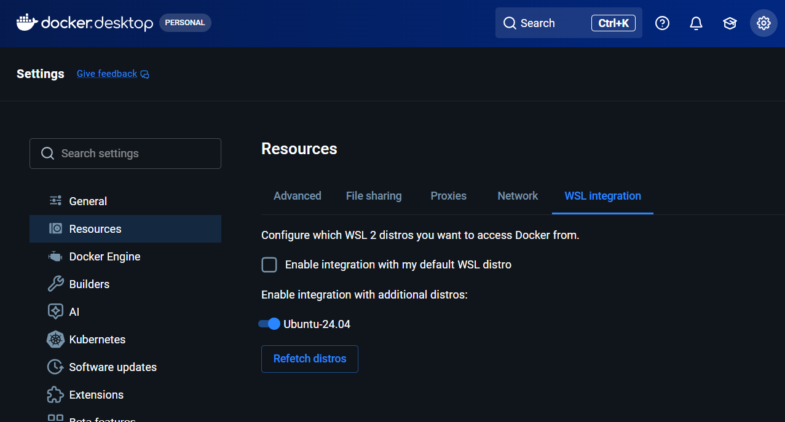

# **Overall Setup Plan**
This is the setup steps for a Windows 11 Pro laptop with Visual Studio Code, Python 3.13 and Git preinstalled.
## 1. Verify Python version
Open PowerShell (not Command Prompt) and run:
```python
python --version
```
or if that fails 
```python
py --version
```

If version is 3.10+, it already satisfies the Zoomcamp requirement.

## 2. Install uv
```uv``` is used for Python dependency management in Zoomcamp projects and it won't interfere with existing PyCharm/VS Code projects using ```pip``` or ```conda```. It is faster and handles virtual environments cleanly. See the [uv documentation](https://docs.astral.sh/uv/) for details.

Open PowerShell and run: 

```python
powershell -ExecutionPolicy ByPass -c "irm https://astral.sh/uv/install.ps1 | iex"
```
After it finishes, close PowerShell completely and open a new PowerShell window to verify:

```python
uv --version
```
If the version appears, the requirement is satisfied.

## 3. Install WSL2 + Ubuntu

The course explicitly recommends this for Windows since Docker works much more smoothly through WSL2. Before installation, check whether WSL is already installed:

```python
wsl --status
```

If it is not installed, open PowerShell as administrator and run:

```python
wsl --install
```

This installation will enable WSL (Windows Subsystem for Linux), enable Virtual Machine Platform, install WSL2 and usually install Ubuntu (usually the latest LTS release). Later, reboot Windows if requested and check what is installed:
```python
wsl --list --online
```

If no Linux distribution is loaded, install one with long-term support. Here, Ubuntu 24.04 LTS is preferred.
```python
wsl --install -d Ubuntu-24.04
```
After the installation, Ubuntu will start automatically. If not, launch Ubuntu from the Start Menu and when asked, create a username and password. At the Linux prompt, run:

```python
uname -a
```
to print all available system information in a single line and 
```python
pwd
```
to print the working directory.

## 4. Install Docker Desktop

Download the Windows installer from [Docker website](https://www.docker.com/products/docker-desktop/?utm_source=chatgpt.com). While running the installer, make sure "Use WSL 2 instead of Hyper-V" is checked. Reboot if requested. After signing in, verify that Docker and WSL are connected correctly. In Docker Desktop, go to Settings -> Resources -> WSL Integration and enable the downloaded Ubuntu version. 



To test Docker in Ubuntu, launch Ubuntu and run:
```python
docker --version
```
```python
docker run hello-world
```
which will show an output like:


## 5. Verify Docker works inside Ubuntu

Run a test container.

## 6. Install Git (if not already installed)
## 7. Create a dedicated Zoomcamp workspace

Separate folder from your existing projects.

## 8. Configure VS Code for WSL

Allows editing Linux files from Windows.

## 9. Install Jupyter support

Needed for notebooks.

## 10. Choose and configure an LLM provider

OpenAI if you want experience with the industry-standard API.
## 11. Clone the Zoomcamp repository
